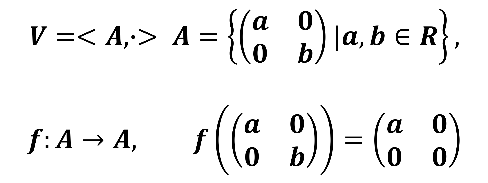

# 第十五章 代数系统

## 运算

**$n \geq 0$ 元运算**：函数 $f: A^n \to A$. 注意运算要求**封闭性**，即运算结果均属于 $A$.

对一种运算，通常使用 **解析表达式** 或 **运算表** 表示。后者对集合有穷的情况，$r_{i, j} = a_i \circ a_j$. 一元运算直接写即可。

特殊符号：
- $M_n(R)$ 代表全体实数 $n$ 阶方阵; 
- $P(B)$ 代表 $B$ 的幂集; 
- $R(B)$ 代表 $B$ 上二元关系的集合；
- $A^A$ 代表所有 $f: A \to A$ 构成的集合。

**单个二元运算的算律**：
- 交换律
- 结合律
- 幂等律（$a \circ a = a$）
- 消去律，即【同除】（$a \circ b = a \circ c, a \neq \theta \to b = c; b \circ a = c \circ a , a \neq \theta \to b = c$）

**两个不同二元运算的算律**: 
- 分配律：**左分配** $a \circ (b * c) = (a \circ b) * (a \circ c)$, **右分配** $(b * c) \circ a = (b \circ a) * (c \circ a)$. 简记：若运算 $A$ ”拆开了“另一种运算 $B$，则说 $A$ 分配了 $B$, 或者说 $A$ 对 $B$ 可分配。

- 吸收律：对两种 **可交换** 运算 $\circ$ 和 $\ast$，若有 $a \circ (a \ast b) = a$ 且 $a \ast (a \circ b) = a$，则称这两种运算有吸收律。举例：$\cap$ 和 $\cup$, $\min$ 和 $\max$.

**二元运算特异元素**：设 $\circ$ 为 $A$ 上二元运算

- 单位元 $e$ （同时为左单位元 & 右单位元）:  $\forall a \in A, a \circ e = e \circ a = a$.

- 零元 $\theta$（同时为左 & 右）: $\forall a \in A, a \circ \theta = \theta \circ a = \theta$.
- 幂等元 $a$: $a \in A, a \circ a = a$.
- 可逆元 $x$ & 逆元 $y$（同时为左逆 & 右逆）: $x \in A, \exists y \in A,  x \circ y = y \circ x = e$. 

**说明**：**存在特异元素也可以作为算律**（如：同一律 $\to$ 存在单位元; 零律 $\to$ 存在逆元）

> **定理 1（若存在左单位元和右单位元，则二者相等且为唯一单位元）**： 对 $A$ 和其上的二元运算 $\circ$, 若存在 $e_l, e_r \in A$ 使得 $\forall x \in A$ 有 $e_l \circ x = x \circ e_r = x$，则 $e_l = e_r = e$ 并且 $e$ 为 $(A, \circ)$ 唯一单位元。

**证明思路**：【使用单位元之间运算来让其直接交互来证明相等。】具体的， $e_l$ 和 $e_r$ 直接交互有 $e_l = e_l \circ e_r = e_r$, 从而二者相等；若还存在另一单位元 $e'$, 则 $e' = e' \circ e = e$, 从而二者也相等。

> **定理 2（若存在左零元 & 右零元，则二者相等且为唯一零元）**： 对 $A$ 和其上的二元运算 $\circ$, 若存在 $\theta_l, \theta_r \in A$ 使得 $\forall x \in A$ 有 $x \circ \theta_l = \theta_r \circ x = \theta$，则 $\theta_l = \theta_r = \theta$ 并且 $\theta$ 为 $(A, \circ)$ 唯一零元。

**证明思路**：同定理 $1$.

> **定理 3 (对【可结合】二元运算，左逆 $=$ 右逆 = 唯一逆元）**：设 $\circ$ 为 $A$ 上可结合二元运算，对 $x \in A$ 若存在 $y_l, y_r$ 使得 $x \circ y_r = y_l \circ x = e$，则 $y_l = y_r = y$ 并且 $y$ 为 $x$ 唯一逆元。

**证明思路**：考虑三项乘积 $y_r \circ x \circ y_l$, 这样可以同时用到结合律和左右逆的性质，从而得到 $y_l = y_r$. 此外若存在另一逆元 $y'$, 同样用 $y' \circ x \circ y$ 结合律得到 $y' = y$.

## 代数系统

常用符号：
- $A$ 表示【载体】
- $\Omega$ 表示【运算集】，满足 $\Omega = \bigcup_{j = 1}^{+\infty} \Omega_j$, $\Omega_j$ 为 $A$ 上所有 $j$ 元运算;
- $K$ 表示代数常数集

**代数系统（构成：成分 + 公理（即算律））的三种记法** $V = \langle A, \Omega, K \rangle$ or $V = \langle A, \Omega\rangle$ or $V = \langle A, o_1, o_2, \ldots, o_r \rangle$. 例子：$\langle Z, +, \dot \rangle$, $\langle P(B), \cap, \cup \rangle$.

**代数系统的分类** 
- **同类型** 只需要运算的元数对应，也就是 $V_1 = \langle A, o_{11} \sim o_{1r} \rangle$, $V_2 = \langle B, o_{21} \sim o_{2r} \rangle$, 只需要满足 $o_{1i}$ 和 $o_{2i}$ 元数相同即可。
- **同种**要求这些运算的性质也相同（如：交换、幂等、结合、吸收、分配、消去），因此同种一定同类型，但同类型不一定同种。

**子代数** 

- 对 $A$ 的**非空子集** $B$，若 $B$ 对于 $V$ 种所有运算封闭，则 $V' = \langle B, o_1 \sim o_r\rangle$ 为 $V$ 的子代数。若 $B$ 是 $A$ 的**真子集**，则 $V'$ 为 $V$ 的**真子代数**。

- $V$ 称作 $V$ 的**平凡子代数。** 此外，若代数常数集合为 $K$, 且 $K$ 也满足上述性质，那么 $\langle K, o_1 \sim o_r \rangle$ 也被称作平凡子代数。

**同类型代数系统的积代数** 对 $V_1 = \langle A, o_{11} \sim o_{1r} \rangle$, $V_2 = \langle B, o_{21} \sim o_{2r} \rangle$, $V_1 \times V_2 = \langle A \times B, o_1 \sim o_r \rangle$, 其中 $o_i$ 也是 $k_i$ 元运算，相当于分别对 pair 的第一维和第二维做运算然后合成一个 pair. 称 $V = V_1 \times V_2$ 为 $V_1, V_2$ 积代数，$V_1, V_2$ 为 $V$ 因子代数。

可以理解为积代数是为两个同类型代数系统提供了一个统一接口，让其可以一起运算。

> **注意**：这里的代数系统中的运算是有序的，因为换一下可以得到另一个积代数。

对积代数，有如下定理：

> 定理：设 $V_1 = \langle A, o_{11} \sim o_{1r} \rangle$ 和 $V_2 = \langle B, o_{21} \sim o_{2r} \rangle$, $V_1$ 和 $V_2$ 积代数为 $V = \langle A \times B, o_1, o_2, \ldots, o_r \rangle$, 则：
> 1. $o_{1i}, o_{2i}$ 分别在 $V_1, V_2$ 中满足交换律（结合/幂等），则 $o_i$ 满足上述性质；
> 2. $o_{1i}$ 对 $o_{1j}$, $o_{2i}$ 对 $o_{2j}$ 分配，则 $o_i$ 对 $o_j$ 分配。
> 3. $o_{1i}, o_{1j}$ 和 $o_{2i}, o_{2j}$ 分别吸收，那么 $o_i, o_j$ 吸收。
> 4. 对 $o_{1i}$ 和 $o_{2i}$ 的单位元 / 零元，组合后依旧是 $o_i$ 的单位元 / 零元。
> 5. 对 $o_{1i}$ 和 $o_{2i}$ 都是含单位元的运算，$a \to a^{-1}, b \to b^{-1}$, 那么 $\langle a, b \rangle$ 的逆元依旧是 $\langle a^{-1}, b^{-1} \rangle$.

也就是说，对位置对应的运算，几乎所有的运算律依旧满足。**注意：消去律不一定满足，因为可以让其中一维度复合一个零元，但是复合之后的东西并不是积代数的零元。** 如：$\langle 0, 1 \rangle \otimes \langle 1, 0 \rangle = \langle 0, 1 \rangle \otimes \langle 0, 0 \rangle$, 然而 $\langle 0, 1 \rangle$ 不是积代数的零元。

因此，若公理无消去律，则积代数与因子代数同种。反之，积代数**不一定**与因子代数同种。

## 代数系统的同态与同构

**同类型的同态映射 $f: A \to B$**：设 $V_1 = \langle A, o_1 \sim o_r \rangle$ 和 $V_2 = \langle B, o_1' \sim o_r' \rangle$ ，$f$ 满足对所有的 $(o_i, o_i')$ 均有 $f(o_i) \equiv o_i'(f)$. 则称 $f$ 是 $V_1 \to V_2$ 的同态映射，简称同态。按映射的性质分为**单同态、满同态、同构（双射）**，按载体分有**自同态**。

**注：同态需要保持所有运算，包括 $0$ 元运算，** 例如 $V = \langle A, \cdot, \begin{bmatrix} 1 & 0 \\ 0 & 1 \end{bmatrix} \rangle$ 的自同态 $f$ 就需要满足 $f(\begin{bmatrix} 1 & 0 \\ 0 & 1 \end{bmatrix}) = \begin{bmatrix} 1 & 0 \\ 0 & 1 \end{bmatrix}$. 

例子：$\langle \mathbb{Z}_n, \oplus \rangle$ 有 $n$ 个自同态，但只有 $\varphi(n)$ 个自同构。（其实只需要选择 $f(1)$ 是谁就可以了，因为 $\mathbb{Z}_n$ 是 $1$ 生成的群）

**同态性质**

> 1. 同态的合成依旧为同态：即 $f: V_1 \to V_2, g: V_2 \to V_3$ 是同态，那么 $g \circ f: V_1 \to V_3$ 也是同态。

**证明思路**：首先显然为映射，$f$ 是同态说明对任意运算对 $o_1, o_2$ 有 $f(o_1) = o_2(f)$. $g$ 是同态说明对任意 $o_2, o_3$ 有 $g(o_2) = o_3(g)$. 从而对运算对 $o_1, o_3$ 有

$$(g \circ f)(o_1) = g(f(o_1)) = g(o_2(f)) = o_3(g(f)) = o_3(g \circ f)$$

因此也是同态。

> 推论：代数系统同构有自反、对称、传递性，是等价关系。

> 2. 同态像是映射到代数系统的**子代数**：即 $f(A)$ 关于 $V_2$ 中运算构成代数系统，并且是 $V_2$ 的子代数，称作 $V_1$ 在 $f$ 下的**同态像**。

**证明思路**：首先说明 

1.  $f(A)$ 是 $A$ 的【非空子集】，这是显然的。

2. $f(A)$ 对 $V_2$ 中所有运算封闭。要证明这点，需要讨论 $0$ 元运算和其它运算：1. 保持了所有代数常数，因此 $0$ 元运算保持；2. 对其他运算，可以求出原像，原像先运算后映射的结果也在像内，因此得证。

从上面的结果可以得知，$f$ 相当于把 $V_1$ 的运算过渡到 $V_2$. 所以有一个挺有意思的性质：

> 3. 若 $f$ 不是满同态，则 $V_2$ 中运算会保持 $V_1$ 中的【交换、结合、幂等、分配、吸收】律；同时 $f(e)$ 是 $V_2$ 中单位元，$f(\theta)$ 是 $V_2$ 中零元，$f(a^{-1}) = f(a)$ 的逆元。

这个结论需要注意两点：

1. 若 $f$ 不是满同态，则上述条件只在 $f(A)$ 中保持。此时，$f(A)$ 中会单独存在单位元，而 $f$ 会将单位元映射到 $f(A)$ 中单位元。一个有趣的例子是

这个例子里 $f$ 就不是满同态了，但是依旧会将 $A$ 中单位元映射到 $f(A)$ 中单位元。

2. **消去律**不一定满足。原因是同态有可能会让信息压缩到：不同的值映射到同一个值，比如 $\mathbb{Z} \to \mathbb{Z} / 6\mathbb{Z}$. 因此消去律可能不成立。（其实这点我也没找到特别好的理解方法）

## 同余关系与同余类

**定义** 对于一个代数系统 $V = \langle A, o_1 \sim o_r \rangle$ 和一个等价关系 $\sim$, 对 $A$ 中任意的元素 $\{ a \}, \{ b \}$, 若 $\forall i, a_i \sim b_i \Rightarrow o_i(a) \sim o_i(b)$, 则称 $\sim$ 对 $o_i$ 有**置换性质**。若 $\sim$ 对 $V$ 中所有运算**都有置换性质**，则称 $\sim$ 是 $V$ 上 **同余关系**，称 $A$ 中等价类为 **同余类**。

显然任何代数系统都存在同余关系，比如所有元素都等价、或者所有元素都不等价。

**商代数** 对 $V = \langle A, o_1 \sim o_r \rangle$ 和同余关系 $R$, 定义 $V/R = \langle A/R, \bar{o}_1 \sim \bar{o}_r \rangle$. 其中：

- $A/R$ 是关于同余关系的商集；
- $\bar{o}_i([a_1], [a_2], \ldots, [a_{k_i}]) = [o_i(a_1, a_2, \ldots, a_{k_i})]$.

代入真 同余关系，会觉得上述商代数和同余关系的定义都是比较自然的。不过首先要证明这是 **良定义** 的：也就是若 $a_j \sim b_j$, 则 $\bar{o_i}(b_j) = \bar{o_i}(a_j)$. 这是显然的，因为 $a_j \sim b_j$ 说明 $o_i(a_j) \sim o_i(b_j)$, 因此 $\bar{o}_i(a_j) =  \bar{o}_i(b_j)$.

有了良定义之后，就可以进一步研究商代数的性质。

> $V/R$ 满足 $V$ 的除了消去律以外的全部律；$[e]$ 是商代数单位元；$[\theta]$ 是商代数的零元；$[a]^{-1} = [a^{-1}]$.

**注意消去律依旧不满足**（考虑同余关系 $\mod 4$, $[2] \times [2] = [0] \times [2]$, 但 $[2] \neq [0]$.）

其实上述内容说明 同余 和 同态 是有一些关系的，下面的内容会进一步说明这一点。

> **（定理 1) 同态映射 导出 同余关系**：设 $V_1 = \langle A, o_1 \sim o_r \rangle$ 和 $V_2 = \langle B, o_1' \sim o_r' \rangle$ ，$f: A \to B$ 是同态映射。则 $f$ 导出的 $A$ 上等价关系为 $V_1$ 上同余关系。

直观来理解，如果拿一些 $f$ 完全相同的做运算，那么可以借助 $V_2$ 中运算的相等形式（$o'(f)$ 相等）来回来得到 $f(o)$ 相等，从而得到 $V_1$ 中运算会在一个等价类内，相当于借助 $B$ 的运算。

具体证明：任取一个运算 $o_i (k_i)$ 和 $\{ a \} \sim \{ b \}$, $f(o_i(a_1, a_2, \ldots, a_{k_i})) = o_i'(f(a_1), f(a_2), \ldots, f(a_{k_i})) = o_i'(f(b_1), f(b_2), \ldots, f(b_{k_i})) = f(o_i(b_1, b_2, \ldots, b_{k_i}))$. 

这个性质说明，每个同态都可以导出一个同余关系。但需要注意的是，并不是所有的关系都可以由自同态导出。比如 $0 \to 2, 1 \to 3, 2 \to 1, 3 \to 0$. (P85)

> **(定理 2) 商代数是原代数的同态像**：设 $V = \langle A, o_1 \sim o_r \rangle$ 和 $R$ 是 $V$ 上的同余关系。则考虑自然映射 $g: g(a) = [a]$, 是 $V \to V/R$ 的同态映射。

这是显然的，因为同态只要求保运算就可以了，而同余类根据定义能满足这一性质。

具体证明：对每个运算 $o_i (k_i)$, 只需证明 $o_i'(g(a_1), g(a_2), \ldots, g(a_{k_i})) = g(o_i(a_1, a_2, \ldots, a_{k_i}))$. 而将 $g(a)$ 写成 $[a]$ 后会发现这是商代数的定义：$o_i'([a_1], [a_2], \ldots, [a_{k_i}]) = [o_i(a_1, a_2, \ldots, a_{k_i})]$.

> **(定理 3) 同态基本定理，同态导出的商代数同构于同态像** 若 $V_1 = \langle A, o_1 \sim o_r \rangle$ 和 $V_2 = \langle B, o_1' \sim o_r' \rangle$ 是同类型代数系统，$f: A \to B$ 是同态映射，$R$ 是 $f$ 导出的 $V_1$ 同余关系，则 $V_1$ 上的同余关系 $R$ 导出的 **商代数** $V_1/R$ 和 $\langle f(A), o_1' \sim o_r' \rangle$ 是 **同构** 的。

定义映射 $h([a]) = f(a)$ 即可（看起来大小是一样的就很同构），后续要依次验证**良定义**，**双射**和**同态映射**三点。

很别扭的一点是要验证 $0$ 元运算，考虑若 $[a] \in V_1/R$ 是零元运算，那么按照商空间的定义 $a$ 在 $V_1$ 中是零元运算，因此 $f(a)$ 也是 $f(A)$ 中零元运算（可以参考之前讲的 $f$ 【保零元运算】）

# 第十六章 半群与独异点

**定义** 
- 广群：封闭二元运算
- 半群 $\langle S, \circ \rangle$：封闭二元运算 + 结合律
- 独异点（幺半群） $\langle S, \circ, e\rangle$：封闭二元运算 + 结合律 + 单位元

注意：任何半群都可以通过扩张单位元的方式变为独异点；表达式中运算符可以省略。

在半群上可以归纳定义**幂运算**：$a^1 = a, a^{n+1} = a^na$. 在独异点可以补充定义 $a^0 = e$. 由二元运算**结合律**，有

> (定理 1) 关于幂运算的性质： $a^na^m = a^{n+m}, (a^n)^m = a^{nm}$.

**子半群 $\langle B, \circ \rangle$** 是半群 $\langle S, \circ \rangle$ 的一个子集，满足 $\circ$ 在 $\emptyset \neq B \subseteq S$ 中封闭。同样可以定义子独异点 $\langle B, \circ, e'\rangle$. **注意：子独异点必须继承独异点的单位元。** 有如下定理：

> (定理 2) 若干子半群的非空交集仍为子半群，若干子独异点的交集仍为子独异点。

证明比较显然，反证即可。

对任意子集 $B \subseteq S$, 可以定义 $B$ 的**生成群** $\langle B \rangle$ 为最小的包含 $B$ 的半群。而这有两种定义方式：

1. 借助 **扩张** 的想法，用 $B$ 中元素做运算直到无法扩张位置，即 $\langle B \rangle = \bigcup_{n \in Z^+} B^n, B^n = \{ b_1 b_2 \cdots b_n \ | b_i \in B \}$.

2. 借助 **子半群的交集** 的想法，即 $\langle B \rangle = \bigcap \{ A \mid B \subseteq A\}$ , 其中 $A$ 是 $S$ 的子半群。

# 第十七章 群

**定义**

1. 可以将群看作代数系统 $\langle G, \circ, ^{-1}, e \rangle$. 定义**非空集合** $G$ 上的**二元运算** $\circ$ 满足：
    - 结合律：对任意 $a, b, c \in G$, $(a \circ b) \circ c = a \circ (b \circ c)$.
    - 单位元：$\exists e \in G$，s.t. $\forall a \in G$，有 $e \circ a = a \circ e = a$.
    - 逆元：对每个 $a \in G$，存在 $a^{-1} \in G$，s.t. $a \circ a^{-1} = a^{-1} \circ a = e$.

> 然而这个定义并不是最简单的定义，其实只需要存在右单位元 $e$ ，并且每个元素 $a$ 都存在右逆元 $a^{-1}$ 即可。

**证明**：先证明 $e$ 是左单位元，即对任何 $a$ 有 $ea = a$. 对此，两侧同乘 $a^{-1}$ 只需证 $eaa^{-1} = aa^{-1}$（可以两侧 $\times a$ 消掉），相当于只需证 $ee = e$, 而由于 $e$ 是右逆这是显然的。

再证明 $a^{-1}$ 是 $a$ 的左逆元，即 $a^{-1}a = e$. 对此，只需证 $aa^{-1}a = ae$, 从而只需证明 $ea = ae$, 而这由 $e$ 是左单位元是显然的。

对一个群，可以定义其**阶**为群的基数（有限群记为 $|G|$），同样也可以定义元素 $a$ 的 $n$ 次幂：

$$
a^n = \begin{cases}
e, n = 0 \\
a^{n-1} a, n > 0 \\
(a^{-1})^m, m = -n, n < 0
\end{cases}
$$

特别的，对任何一个元素 $a$, 定义其「阶」为**使得 $a^k = e$ 的最小正整数 $k$**. 若不存在这样的 $k$, 则称其阶为 $\infty$.（例如：$\langle \mathbb{Z}, + \rangle$）对于有限群，其阶肯定是有限的（特别的，阶是群的阶的因子）。但是若每个元素都是有限阶的，那么群的阶不一定是有限的，比如所有单位根和乘法构成的群。（可列 和 有限 不一样）

对幂运算有如下规则：

> $(a^{-1})^{-1} = a, (ab)^{-1} = b^{-1}a^{-1}, a^na^m = a^{n+m}, (a^n)^m = a^{nm}$

让我们看一下下面的定理

> **定理 3** $ax=b$ 和 $ya=b$ 在群 $G$ 中有解且有唯一解。

证明：只考虑 $ax=b$. 首先 $x=a^{-1}b$ 一定是一组解。若还有别的解 $c$ 满足 $ac=b$, 那么两侧同乘 $a^{-1}$ 有 $c=a^{-1}b$.

> **定理 4** 对半群 $G$, 若对任意 $a, b \in G$ 有 $ax=b$ 和 $ya=b$ 在 $G$ 中有解，则 $G$ 为群。

证明：只需要证明有 **右单位元** 和每个元素的 **右逆元**。这里任取一个元素 $b$, 用 $bx=b$ 的解 $x$ 当作 $e$.

那么对任意 $a$ 可以将其分解为 $a = cb$（由于 $?b = a$ 有解），从而 $ae = cbe = cb = a$, 从而 $e$ 是右单位元。然后由 $ax=e$ 均有解和 $a$ 的任意性，得到每个元素均有右逆元。

> **定理 5（消去律）** $ab=ac \Rightarrow b=c$, $ba=ca \Rightarrow b=c$. 

显然，每个元素有逆元，这也证明了群里没有零元。

> **定理 6** 对有限半群 $G$, 若 $G$ 不含零元且消去律成立，则 $G$ 是群。

证明：**试图调用定理 4.** 有限的好处是可以将所有可能的乘积全列出来，也就是对于 $a_i$ 我们定义 $a_i G = \{ a_i a_j \mid j = 1 \sim n\}$. 不过根据消去律 $a_i G$ 中元素两两不同且封闭，因此 $a_i G = G$, 因此对于任意 $a_j$ 一定存在 $a_k$ 使得 $a_i a_k = a_j$. 同理可以证明一定存在 $a_k$ 使得 $a_k a_i = a_j$, 从而 $G$ 是群。

从上面定理 6 可以知道下面的定理 7:

> **定理 7** 若 $G$ 是群，则 $\forall a\in G,aG=G, Ga=G$ 

不过反之不一定成立，因为运算要满足结合律。

> **定理 8** 若 $G$ 是群，且 $|a| = r$, 则 1.  $a^k = e \Rightarrow r|k$; 2. $|a| = |a^{-1}|$; 3. 若 $|G| = n$, 则 $r \leq n$.

证明：反证法证明即可。

有一些有关于阶的重要结论：

> 1. $|a| = 1,2 \Leftrightarrow a=a^{-1}$
> 2. $|a| = |a^{-1}|, |ab| = |ba|, |a| = |bab^{-1}|$, 因此将 $bab^{-1}$ 称作 $a$ 的一个**共轭元**。
> 3. $|a| = r \Rightarrow |a^t| = \frac{r}{(t, r)}$
> 4. $|a| = n, |b| = m, ab = ba \Rightarrow |ab||[n, m]$. 若 $(n, m) = 1$, 则 $|ab|=nm$.

有一些算阶的套路：

> $|x| = |y|$ 证明：设 $|x| = r, |y| = s$, 分别证明 $x^s = e$ 和 $y^r = e$ 导出 $r|s, s|r$ 即可。
> 求 $|x|$: 构造 $n$ 使得 $x^n = e$,分析 $n$ 的因子。
