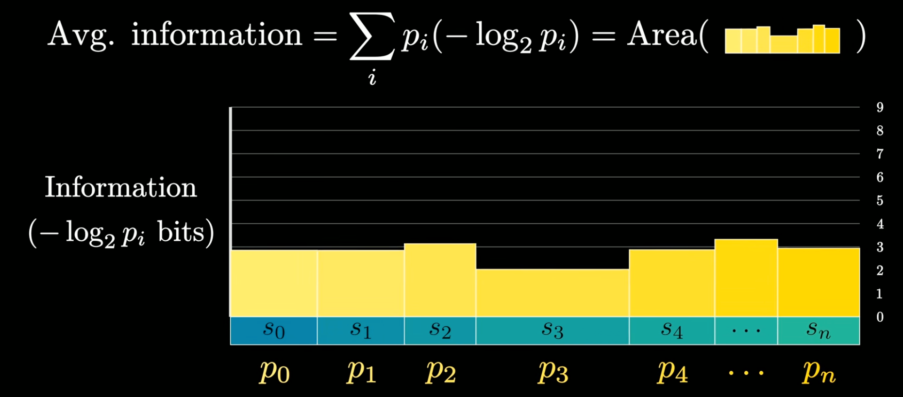

# Compression is Intelligence

## 引子：Huffman Code

> 现有 $4$ 种字符 $a, b, c, d$ 要发送，每种字符的出现频率分别为 $p(a) = \frac{1}{2}, p(b) = \frac{1}{4}, p(c) = p(d) = \frac{1}{8}$, 需要设计一套前缀编码方式，使得发送它们的期望码字长度最短。

这是一个经典的 Huffman Code 问题，可以通过贪心构造来解决，例如令 $a \to 0, b \to 10, c \to 110, d \to 111$. 

常规的最优性证明方法是反证法。但如果忽略掉这套理论工具，会发现得到的最优解中，码字的长度和字符的出现频率非常相关，即若对字符 $x$ 有 $p(x) = 2^{-n}$, 那么其长度 $l(x) = n$. 这是否是偶然呢？或者说，有没有优雅的办法证明上述编码是最优的？

对此，要从第一性原理出发，分析完美压缩的性质。

## 完美压缩

### 完美压缩 = 随机噪声

如果对于一条消息能够进行“完美”的压缩，需要满足压缩得到的 $01$ 串是**随机**的。这里随机的定义是：

1. 每一位是 $0/1$ 的概率都是均等的；

2. 位与位之间是独立的。

需要满足上面性质的原因是：若不满足上述性质，可以对消息进行**进一步压缩**。例如：

1. 若 $0/1$ 出现的概率不均等，那可以知道 $00, 01, 10, 11$ 三种 pattern 出现的概率也不均等，那么可以进一步压缩（如：定义规则 $00 \to 0, 01 \to 10, 10 \to 110, 11 \to 111$）。

2. 若位与位之间不独立，例如相邻两位相等的概率很高，那可以通过构造**差分序列**的方式构造 $1$ 中 $0/1$ 出现概率不均等的序列。

实际会比上面更复杂，不过总之可以得到，一些消息进行完美压缩后，得到的应该是一个随机噪声。

### 完美压缩 = 对 $l$ 位码字 $w$, 其原字符 $x$ 恰好以 $1/{2^l}$ 概率在原文中出现

一旦接受了这个设定，就可以得到这个优美的结论，证明如下：

> 考虑一个 Decoder 恰好识别完一个码字，考虑下面 $l$ 位，出现 $w$ 的概率恰好为 $1/{2^l}$. 而若出现，Decoder 一定会将其识别为 $x$, 因此 $x$ 在原文中一定恰好有 $1/{2^l}$ 概率出现。

值得说明的是，也存在非常直观的理解方式：

> 可以设计一个 $1 \times 1$ 的正方形，通过不断等分来划分出 $1/{2^l}$ 面积的区域。只需要用这个长度为 $l$ 的码字来界定划分过程中选择“哪一边”即可。也就是说，码字实际构造的是一条路径，最后锁定到了 $1/{2^l}$ 的区域。

### 信息：$I = -\log_2(p)$

若对一个出现概率为 $p$ 的字符，定义 $\text{Information}:=-\log_2(p)$, 则在完美压缩中，编码长度 $=$ 信息长度。同样地，这个信息相当于“要描述这个事件”的难度，如果可视化出来就是定位的难度。

当然一般的压缩不是完美的，这个信息刻画的是编码长度的下界。

### 熵 (Entropy)

对一个序列，可以定义其字符平均信息，或者说，期望字符编码长度

$$\sum_{x} -p(x) \log_2 p(x)$$

这是一个下界，仅仅在完美压缩时得到实现，可以将其命名为“熵”（Entropy）。下面的图中，黄色矩形面积就代表了这个期望长度

